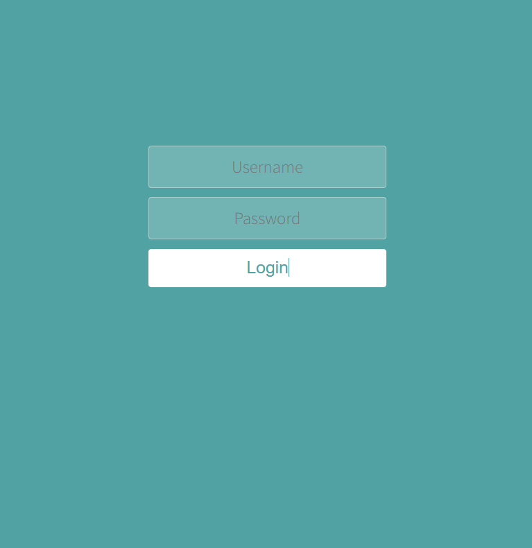
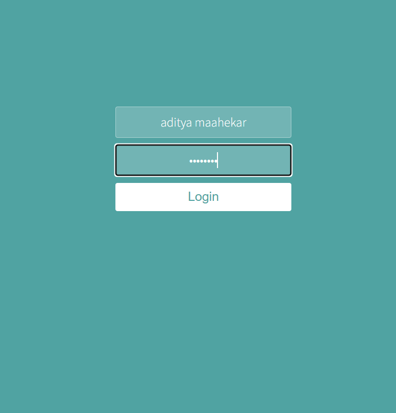
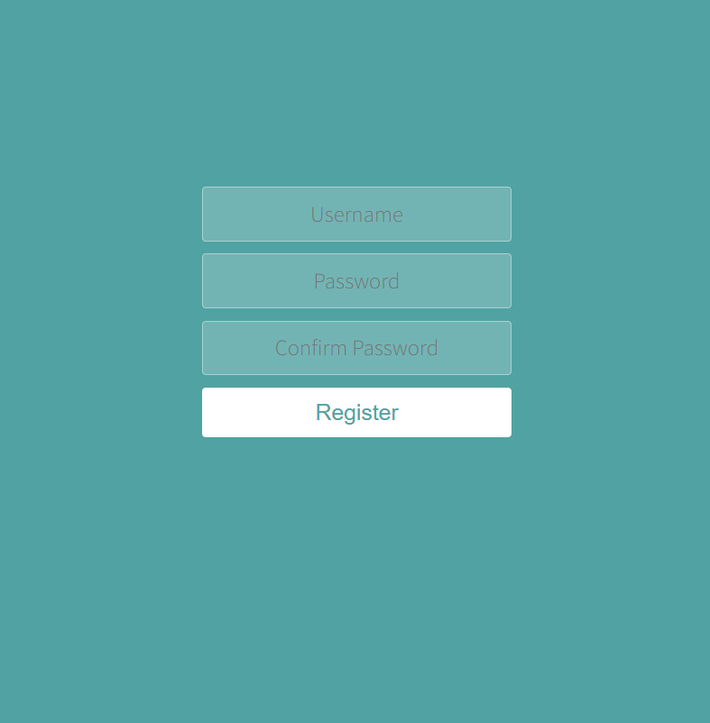
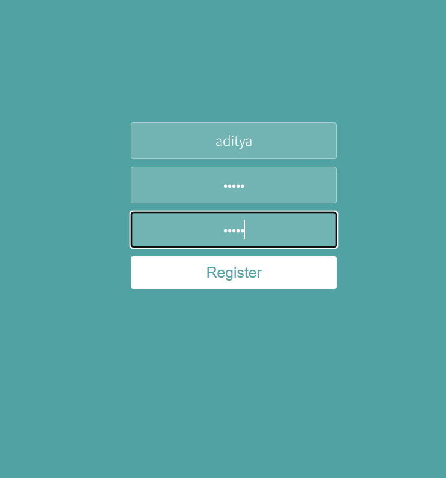

# 🔐 Login and Register (React.js Project)

A clean and simple **React.js application** that demonstrates **Login** and **Register** user interfaces.  
Built using **React**, **JavaScript (ES6)**, **HTML5**, and **CSS3**.

---

## 🖼️ Screenshots  

| 🔑 LogIn 1 | 🔑 LogIn 2 |
|------------|------------|
|  |   |

| 📝 Register 1 | 📝 Register 2 |
|---------------|---------------|
|  |  |

---

## 🛠️ Tech Stack
- ⚛️ **React.js**  
- 💻 **JavaScript (ES6)**  
- 🌐 **HTML5**  
- 🎨 **CSS3**  
- 🚀 **Vite / Create React App**

---

## ⚛️ React Installation & Application Setup

## 📦 Installation


Install the node modules
```bash
npm install
```

Launch your React project in your browser
```bash
npm run dev
```
